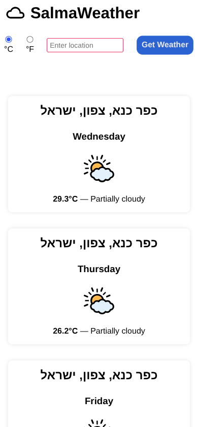

# SalmaWeather
SalmaWeather Project, [TOP project](https://www.theodinproject.com/lessons/node-path-javascript-weather-app)

I used MVC with pure javascript.

FontAwsome for icons

Mobile first design

[Code at GitHub](https://github.com/mdahamshi/top-weather)

[Live DEMO](https://mdahamshi.github.io/top-weather)

